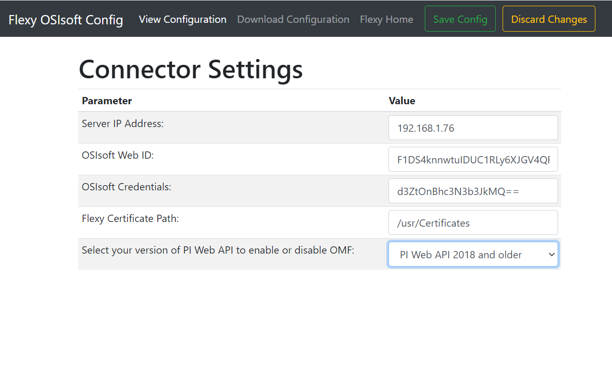

# Ewon Flexy OSIsoft Connector

## About

This application connects tags from a Flexy to an OSIsoft PI dataserver.

## Support

This application is supported by HMS' North American offices.

| Phone                                        | Forum                                      | Email                                           |
|:--------------------------------------------:|:------------------------------------------:|:-----------------------------------------------:|
| [+1 312 829 0601](tel:13128290601), Option 2 | [hms.how](https://forum.hms-networks.com/) | [us-services@hms.se](mailto:us-services@hms.se) |


## [Table of Contents](#table-of-contents)

1. [Getting Started](#Getting-Started)
   1. [Configuration](#Configuration)
   2. [Clock Settings](#Flexy-Clock-Settings)
   3. [Installation](#Installation)
   4. [Running](#Running)
2. [Certificates](#Certificates)
3. [Configuration File](#Configuration-File)
4. [Customizing the Application](#Customizing-the-application)

## Getting Started

### Configuration

User configuration of the application parameters is done through the ConnectorConfig.json file.  This file must be modified to match your configuration.

#### Web Configuration

The ConnectorConfig.json file can be edited through the configuration webpage.  The configuration webpage can be accessed after the [installation process](#Installation) has been completed.  The url for the configuration interface **Your_Flexy's_IP_Address**/usr/config.html



#### FTP Configuration
If you wish to manually edit your ConnectorConfig.json file or you have a saved ConnectorConfig.json file from another Flexy you can load your ConnectorConfig.json file on the flexy in the /usr/ directory via FTP.

### Flexy Clock Settings
The Flexy's clock must be set to Coordinated Universal Time (UTC) in order to post accurate timestamps to OSIsoft.  This can be done manually on the Flexy's websever under Setup->System->Main->General->Date & Time or NTP can be used if there is an internet connection available.  NTP is setup in Setup->System->Main->Net services->NTP (time).  If using NTP time make sure the GMT Offset is set to zero hours

### Installation

Using FTP transfer the contents of the osisoft_connector directory to the /usr/ directory of your eWON via FTP.  If successful you should have a css directory, js directory, config.html, ConnectorConfig.json, flexy-osisoft-connector.jar, and jvmrun located in the /usr/ directory of the Flexy.  You must also follow all steps in the Certificates section below.

### Tag's Configuration

The tag's historical logs are the source for the data pushed to OSIsoft, so settings for your historical logging will effect what data can get sent to OSIsoft. Make sure you enable historical logging in your tag settings. 
+ On the flexy web page, navigate to Tags -> values
+ On the web top left section of the page, switch the mode from view to setup
+ Click on your tag that you wish to configure, and click on edit
+ On the tag configuration panel scroll down and enable Historical Logging

We suggest you make use of both the available historical logging settings: Logging Deadband and Logging Interval. More information on Logging DeadBand is listed below.

#### Logging Deadband

If you set a deadband of 1, then the tag value will need to change by a value of 1 or more before being logged. If Deadband is set to 2, the value needs to change by 2 or more before being logged. If you have logging deadband disabled (set to -1) we recommend you set the historical log's logging interval setting to something high if possible. Set the deadband to whatever your lowest unit of interest is.

### Running

The application will start automatically on startup

## Certificates

The Flexy by default only allows HTTPS connections with servers that have certificates verified by a trusted certificate authority.  To enable a HTTPS connections with a server that has a self signed certificate the Flexy must have a copy of that certificate.  Follow the steps outlined in this section to create and install a new certificate.

### Generate the certificate

Here is an example of generating a certificate using openssl.

Generate a certificate and a private key good for 5 years.
```console
openssl req -newkey rsa:2048 -nodes -keyout key.pem -x509 -days 1825 -out certificate.crt
```
Answer the prompts, making sure that your set the "Common Name" to the IP Address of your server.

Combine the certificate and private key into a .p12 file
```console
openssl pkcs12 -inkey key.pem -in certificate.crt -export -out certificate.p12
```

You will be prompted to enter an export password, the again to verify.  Remember this password.

### Install the certificate on server
These installation instructions are specific to Windows 7.  If your server is running on a different OS the process may differ.

In Windows, right click on your certificate.crt file and click Install Certificate.  Follow the prompts and place the certificate in the "Trusted Root Certification Authorities" store.  When you click finish a security prompt will warn you that it cannot validate the certificate's origin and ask if you want to install this certificate, click yes.

Run mmc.exe.  Click "File"->"Add/Remove Snap-in...".  From the "Available snap-ins" add "Certificates" to the "Selected snap-ins", set the permissions to "Computer account" when prompted, then select your local computer.  Click "Finish", then "Ok".  Expand "Certificates (Local Computer)", then expand "Personal", then expand and select "Certificates". Click "Action"->"All Tasks"->"Import". Click "Next" then "Browse".  The the file open window select the file extension to be "Personal Information Exchange (*.pfx;*.p12)".  Find and select your "certificate.p12" file, then click open then next.  You will now be prompted to enter in your export password from when you created your certificate.p12 file, after doing so click next.  Place the certificate in the "Personal" certificate store, then click "Next" then "Finish".  You should be prompted that the import was successful, click "OK".

Run "PI Web API Admin Utility". Configure the server normally.  When you get to the "Certificate" setup page click "Change".  You may be prompted that a certificate binding is already configured, click "Yes" to "Do you still want to change the certificate?".  Select the certificate you created from the list and click "OK".  Continue with the rest of the configuration normally.

### Transfer certificate to Flexy

The file certificate.crt must be placed somewhere in the /usr directory of the Flexy. The certificate can be transferred to the Flexy using FTP. The "CertificatePath" in ConnectorConfig.json must be updated with the path to where you store the certificate file.
```
// Path to the directory containing your OSIsoft server's certificate
static String eWONCertificatePath = "/usr/Certificates";
```

## Configuration File

### Example ConnectorConfig.json
```
{
   "ServerConfig":{
      "IP":"192.168.0.124",
      "WebID":"s0U1IjG6kMOEW7mxyHCuX2mAUEktU0VSVkVSLVBD",
      "Credentials":"UEktU2VydmVyOk1hbmNoZXN0ZXIxMjMh"
   },
   "eWONConfig":{
      "CertificatePath":"/usr/Certificates"
   },
   "AppConfig":{
      "CycleTimeMs":1000,
      "PostDuplicateTagValues": false,
      "CommunicationType":"omf"
   },
   "TagList":["ExampleTag1", "ExampleTag2", "ExampleTag3", "ExampleTag4"]
}
```
### ServerConfig

The OSIsoft PI Database Web API must be installed for this connector to work.  The connector requires three items to connect to the OSIsoft PI Web API they are the IP address of the server running the PI Web API, WebID of the PI Web API and a valid user name and password for the system running the PI Web API software.

IP – IP address of the system running the Web API (in this example assume the IP address is 192.168.0.124)

WebID – WebID of your OSIsoft Web API.  This value can be attained by pointing a browser to the IP address (https://192.168.0.124/piwebapi/dataservers).  The WebID is one of several parameters returned.  A username and password will be required to access the page.  If a username is not required it may be cached.  Try clearing the cache to verify the username and password.  The same username and password will be used to create the credentials in the next step.  (A security warning may occur when trying to access this page, this warning should be ignored)

### Credentials - Base64 encoded user credentials for basic authentication

To generate your Base64 encoded user credentials visit https://www.base64encode.org/ and encode "username:password"

Example: If your username is 'username' and your password is 'password' you would encode "username:password" and should get "dXNlcm5hbWU6cGFzc3dvcmQ="

### eWONConfig

CertificatePath - Path to the directory containing your server's certificate.  For more information see the Certificates section

### AppConfig

CycleTimeMs - Cycle time of the application.  All tags will be posted at this specified interval

PostDuplicateTagValues - Controls when datapoints are logged.  If set to true, datapoints will always be cyclicly logged. If set to false, datapoints will only be logged on change of value.

CommunicationType - This refers to if you are using OMF (OSIsoft message format). If you have PIWEBAPI 2019 or later, and you have OMF enabled, set this string to "omf". If you are using an older version of PIWEBAPI set the string to "piwebapi". Any other values will result in an error. For more information on OMF read the section here:  [OMF](#OMF-Support)

### TagList

TagList - List of eWON tags that should be connected to the OSIsoft PI server.  If PI Points with (non case sensitive) matching names do not exist on the PI server they will be created automatically.

## Customizing the application

If you wish to modify, debug, or rebuild the application the toolkit and documentation is available here https://developer.ewon.biz/content/java-0. The instructions for setting up your development environment are here  https://developer.ewon.biz/system/files_force/AUG-072-0-EN-%28JAVA%20J2SE%20Toolkit%20for%20eWON%20Flexy%29.pdf?download=1

## OMF Support

The OSIsoft connector now has the ability to support OMF. To enable OMF follow the following steps:
1. Download the latest version of PIWEBAPI - PIWEBAPI 2019 or later is required.
   1. Install the new software.
1. Enable CSRFDefence.
   1. Open Pi System Explorer.
   1. Expand elements -> osisoft -> PI Web API -> 'computer name' -> System Configuration
   1. Click on attributes and find the field for EnableCSRFDefence.
   1. Change the value to true and click the 'check in' button at the top.
1. Run the PI Web API Admin Utility.
   1. In the OMF services section of the configuration tool, click edit.
   1. Make sure there is a green checkmark next to every field.
   1. IMPORTANT: The PI Data Archive Server can disconnect for various reasons. Make sure this is connected if you have a connection issue.
   1. Click confirm and finish running the utility.

## Troubleshooting common issues

Commonly encountered issues:

* Certificates
    * You will not be able to connect to the server if the certificate is incorrect.
    * The first thing to check is the 'common name' of the certificate. This needs to match the ip address or domain name of your OSIsoft server's machine.
* Not connecting when OMF support is enabled.
    * We have found that you may need to rerun the PI Web API Admin Utility to ensure that PI data archive is connected. This is especially true if the connector was working properly and then stopped working after restarting the OSIsoft server machine.
