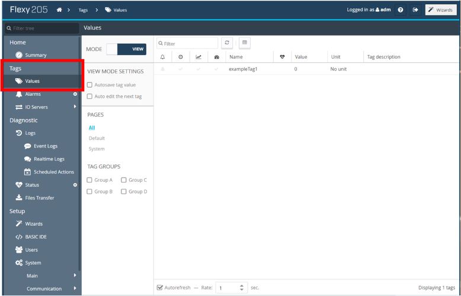
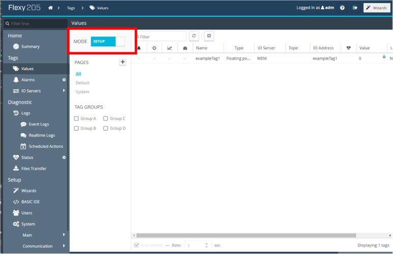
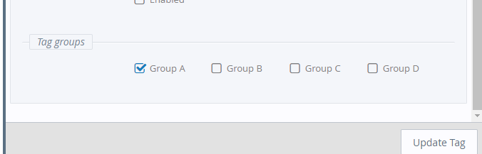

# Ewon Flexy OSIsoft Connector

## About

This application connects tags from a Flexy to an OSIsoft PI dataserver.

## Support

This application is supported by HMS' North American offices.

| Phone                                        | Forum                                      | Email                                           |
|:--------------------------------------------:|:------------------------------------------:|:-----------------------------------------------:|
| [+1 312 829 0601](tel:13128290601), Option 2 | [hms.how](https://forum.hms-networks.com/) | [us-services@hms.se](mailto:us-services@hms.se) |


## [Table of Contents](#table-of-contents)

1. [General Information](#General-Information)
2. [Getting Started](#Getting-Started)
   1. [Configuration](#Configuration)
   2. [Flexy Configuration](#Flexy-Configuration)
   3. [Installation](#Installation)
   4. [Running](#Running)
3. [Certificates](#Certificates)
   1. [Generate The Certificate](#generate-the-certificate)
   2. [Install The Certificate On Server](#install-the-certificate-on-server)
   3. [Transfer Certificate To Flexy](#transfer-certificate-to-flexy)
4. [Configuration File](#Configuration-File)
   1. [Example ConnectorConfig.json](#example-connectorconfigjson)
   2. [Server Config](#serverconfig)
      1. [URL](#url)
      2. [Web ID](#webid)
      3. [Proxy URL](#proxy-url)
      4. [Credentials](#credentials)
   3. [Ewon Config](#ewonconfig)
      1. [Certificate Path](#certificatepath)
   4. [App Config](#appconfig)
      1. [Communication Type](#communicationtype)
      2. [HTTP Timeout Seconds](#httptimeoutseconds)
      3. [OSIsoft Tag Naming Scheme](#osisofttagnamingscheme)
      4. [LoggingLevel](#logginglevel)
5. [Customizing The Application](#Customizing-the-application)
6. [Tag Configuration](#Tag-Configuration)
7. [OMF Support](#OMF-Support)
8. [OSIsoft Cloud Service](#OSIsoft-Cloud-Service)
9. [JVM Logger](#JVM-Logger)
10. [Troubleshooting Common Issues](#Troubleshooting-common-issues)

## General Information
The OSIsoft connector makes use of the Flexy's historical logging functionality to send historical data points from a Flexy to OSIsoft PIWebApi. The connector utilizes this functionality to buffer up to 900,000 data points when connection to PIWebApi is lost.
More information can be found here: [Ewon Historical Logging](https://developer.ewon.biz/content/historical-logging)

## Getting Started

### Configuration

User configuration of the application parameters is done through the ConnectorConfig.json file.  This file must be modified to match your configuration.

#### Web Configuration

#### FTP Configuration
If To change configuration values, manually edit your ConnectorConfig.json file on the Flexy in the /usr/ directory via FTP.

### Flexy Configuration

### Installation

Using FTP transfer the contents of the osisoft_connector directory to the /usr/ directory of your eWON via FTP.  If successful you should have a css directory, js directory, config.html, ConnectorConfig.json, flexy-osisoft-connector.jar, and jvmrun located in the /usr/ directory of the Flexy.  You must also follow all steps in the Certificates section below.

### Running

The application will start automatically on startup

## Certificates

The Flexy by default only allows HTTPS connections with servers that have certificates verified by a trusted certificate authority.  To enable a HTTPS connections with a server that has a self signed certificate the Flexy must have a copy of that certificate.  Follow the steps outlined in this section to create and install a new certificate.

### Generate the certificate

Here is an example of generating a certificate using openssl.

Generate a certificate and a private key good for 5 years.
```console
openssl req -newkey rsa:2048 -nodes -keyout key.pem -x509 -days 1825 -out certificate.crt
```
Answer the prompts, making sure that your set the "Common Name" to the IP Address of your server.

Combine the certificate and private key into a .p12 file
```console
openssl pkcs12 -inkey key.pem -in certificate.crt -export -out certificate.p12
```

You will be prompted to enter an export password, the again to verify.  Remember this password.

### Install the certificate on server
These installation instructions are specific to Windows 7.  If your server is running on a different OS the process may differ.

In Windows, right click on your certificate.crt file and click Install Certificate.  Follow the prompts and place the certificate in the "Trusted Root Certification Authorities" store.  When you click finish a security prompt will warn you that it cannot validate the certificate's origin and ask if you want to install this certificate, click yes.

Run mmc.exe.  Click "File"->"Add/Remove Snap-in...".  From the "Available snap-ins" add "Certificates" to the "Selected snap-ins", set the permissions to "Computer account" when prompted, then select your local computer.  Click "Finish", then "Ok".  Expand "Certificates (Local Computer)", then expand "Personal", then expand and select "Certificates". Click "Action"->"All Tasks"->"Import". Click "Next" then "Browse".  The the file open window select the file extension to be "Personal Information Exchange (*.pfx;*.p12)".  Find and select your "certificate.p12" file, then click open then next.  You will now be prompted to enter in your export password from when you created your certificate.p12 file, after doing so click next.  Place the certificate in the "Personal" certificate store, then click "Next" then "Finish".  You should be prompted that the import was successful, click "OK".

Run "PI Web API Admin Utility". Configure the server normally.  When you get to the "Certificate" setup page click "Change".  You may be prompted that a certificate binding is already configured, click "Yes" to "Do you still want to change the certificate?".  Select the certificate you created from the list and click "OK".  Continue with the rest of the configuration normally.

### Transfer certificate to Flexy

The file certificate.crt must be placed somewhere in the /usr directory of the Flexy. The certificate can be transferred to the Flexy using FTP. The "CertificatePath" in ConnectorConfig.json must be updated with the path to where you store the certificate file.
```
// Path to the directory containing your OSIsoft server's certificate
static String eWONCertificatePath = "/usr/Certificates";
```

## Configuration File

### Example ConnectorConfig.json
``` JSON
{
   "ServerConfig":{
      "URL":"192.168.0.124",
      "WebID":"s0U1IjG6kMOEW7mxyHCuX2mAUEktU0VSVkVSLVBD",
      "Credentials":"UEktU2VydmVyOk1hbmNoZXN0ZXIxMjMh",
      "ProxyURL":"long/proxy/example/omf"
   },
   "eWONConfig":{
      "CertificatePath":"/usr/Certificates"
   },
   "AppConfig":{
      "CommunicationType":"omf",
      "OSIsoftTagNamingScheme":"default",
      "LoggingLevel": 4,
      "httpTimeoutSeconds": 2
   }
}
```
### ServerConfig

The OSIsoft PI Database Web API must be installed for this connector to work.  The connector requires three items to connect to the OSIsoft PI Web API they are the URL of the server running the PI Web API, WebID of the PI Web API and a valid user name and password for the system running the PI Web API software.

#### URL
IP address or domain name of the system running the Web API (in this example assume the IP address is 192.168.0.124)

#### WebID
This field is only needed when the CommunicationType is set to "piwebapi". WebID is the web ID of your OSIsoft PI Web API.
This value can be attained by pointing a browser to the OSIsoft PIWEBAPI URL (https://192.168.0.124/piwebapi/dataservers).  The WebID is one of several parameters returned.  A username and password will be required to access the page.  If a username is not required it may be cached.  Try clearing the cache to verify the username and password.  The same username and password will be used to create the credentials in the next step. 
(If the PIWEBAPI certificates are self-signed a security warning may occur when trying to access this page. This warning should be ignored)

#### Proxy URL

This optional field is only needed when using a non default endpoint of https://HOSTNAME/piwebapi. Adding the field "ProxyURL" under the server config section will change request endpoints to https://HOSTNAME/proxy-path. HOSTNAME will be retrieved from the URL field in the configuration file. 

Below is a partial config file with the optional proxy URL in use. Its endpoint is set to https://192.168.1.1/long/proxy/example/omf
   ``` JSON
   {
   "ServerConfig":{
      "URL":"192.168.1.1",
      "ProxyURL":"long/proxy/example/omf"
      },
   }
   ```

#### Credentials
Base64 encoded user credentials for basic authentication

To generate your Base64 encoded user credentials visit https://www.base64encode.org/ and encode "username:password"

Example: If your username is 'username' and your password is 'password' you would encode "username:password" and should get "dXNlcm5hbWU6cGFzc3dvcmQ="

### eWONConfig

#### CertificatePath
Path to the directory containing your server's certificate.  For more information see the Certificates section

### AppConfig

#### CommunicationType
This refers to if you are using OMF (OSIsoft message format) or PIWEBAPI. OMF is the recommended setting. 
The valid values are as follows:
* "omf" 
* "piwebapi" 

For more information on OMF read the section here:  [OMF](#OMF-Support)

#### httpTimeoutSeconds
Optional field to override the default value used for HTTPS_TIMEOUT_S. If omitted the default value of 2 will be used.
This field is only needed if https requests consistently take large amounts of time to complete.

#### OSIsoftTagNamingScheme
This field is to configure how OSIsoft tags will be named. The options are listed below:

* default, which stands for TN-SN-TT
* SN, which stands for serial number
* TN, which stands for tag name
* TT, which stands for tag type.

If the value of "default" is given, tag naming scheme will be set to TN-SN-TT. tags would be named as (tag name)-(serial number)-(tag type).
The following are rules to make a valid tag name scheme:

* Tag name scheme must include the tag name
* Tag name options must be separated by the "-" delimiter
* There cannot be more than 3 tag name scheme options present
* There cannot be less than 1 tag name scheme option present
* There cannot be any options used other than the 4 listed values of "default", "SN", "TN", or "TT"

#### LoggingLevel
The OSIsoft connector uses the [HMS Solution Center logging library](https://github.com/hms-networks/sc-flexy-logger-lib) for application logging to the Ewon Flexy's realtime logs.

To change the logging level in the configuration file, specify the logging level under the AppConfig object.
LoggingLevel is an optional field in the configuration file and is not required by the application to properly run.

Below is a partial example of the configuration file set to log general application state information.
See [Log Level](https://github.com/hms-networks/sc-flexy-logger-lib#log-level) for more information.
   ``` JSON
   {
   "AppConfig": {
       "LoggingLevel": 4
       }
   }
   ```

## Customizing the application

If you wish to modify, debug, or rebuild the application the toolkit and documentation is available here https://developer.ewon.biz/content/java-0. The instructions for setting up your development environment are here  https://developer.ewon.biz/system/files_force/AUG-072-0-EN-%28JAVA%20J2SE%20Toolkit%20for%20eWON%20Flexy%29.pdf?download=1

## Tag Configuration
To have a tag's historical data sent to OSIsoft, the tag needs to have historical logging enabled and needs to be assigned to a group. Follow the steps below for each tag.

>Navigate to the tag values page. If the "mode" slider on the top left of the screen is set to "view", click on it to set it to "setup".



>Double click on a tag to open the tag configuration page.
>Enable historical logging for each tag you want recorded in OSIsoft by clicking the "Historical Logging Enabled" checkbox. 



>Ensure the tag is added to a group. If it is not, no the tag data will not be sent to OSIsoft.



## OMF Support

The OSIsoft connector now has the ability to support OMF. To enable OMF follow the following steps:
1. Download the latest version of PIWEBAPI - PIWEBAPI 2019 or later is required.
   1. Install the new software.
1. Enable CSRFDefence.
   1. Open Pi System Explorer.
   1. Expand elements -> osisoft -> PI Web API -> 'computer name' -> System Configuration
   1. Click on attributes and find the field for EnableCSRFDefence.
   1. Change the value to true and click the 'check in' button at the top.
1. Run the PI Web API Admin Utility.
   1. In the OMF services section of the configuration tool, click edit.
   1. Make sure there is a green checkmark next to every field.
   1. IMPORTANT: The PI Data Archive Server can disconnect for various reasons. Make sure this is connected if you have a connection issue.
   1. Click confirm and finish running the utility.

## OSIsoft Cloud Service

### OCS Account Setup
The OSIsoft connector supports an OCS connection. To make use of this feature, follow the below steps.
1. First create an OCS account.
1. Under the namespace tab, create an OCS namespace of your choosing.
   1. Save the namespace for later use. It will be needed in another step.
1. Under the client tab, create a client.
   1. Select "Client-Credentials" as the client type.
   1. Click the "Add Client button.
   1. Give the client a name. NOTE: the client will be the Flexy device.
   1. Select the "Account Administrator" role which will check all the role selection boxes.
   1. Make sure the token lifetime is set to 3600 seconds.
   1. Add a secret decription of your choosing.
   1. Check the box that says "Never Expires".
   1. Click "Add".
   1. Copy both the client ID and client secret to use later.
1. Under the connections tab, create a new client connection.
   1. Select OMF as the connection type.
   1. Click the "Add Connection" button.
   1. Enter the connection name, and hit next.
   1. Select the client you just created and hit next.
   1. Select the namespace you created and hit next.
   1. Click the "Save" button.
   1. Expand the dropdown menu that now shows up under the list of clients.
   1. Click on your new client, more details will be available on the right hand panel.
1. Obtain the Client ID.
   1. Navigate to the namespace tab.
   1. Select your namespace.
   1. Click the "Display Details" button.
   1. Copy the Account id for later use. This is your tenant ID.
   
The namespace and tenantId will need to be added to the ConnectorConfig file and uploaded to the Flexy.
The Client ID and the Client Secret will be needed for the basic script you will have running on the Flexy.

### Flexy OCS Configuration File Changes
1. Add OCS information to the ConnectorConfig.json file.
   1. Replace the xxx below with your namespace.
   1. Replace the yyy below with your tenant ID.
   1. Copy these into the ServerConfig portion of the json file.
      ``` JSON
      "Namespace":"xxx",
      "TenantId":"yyy"
      ```
   1. Make sure that the JSON formatting is valid. Below is an example of a properly formatted configuration file.
   ``` JSON
   {
   "ServerConfig":{
      "URL":"192.168.1.8",
      "WebID":"F1DS4knnwtuIDUC1RLy6XJGV4QREVTS1RPUC0wQ1MyUDFT",
      "Credentials":"dsZtOnBfdsjklfh==",
      "Namespace":"testNameSpace1",
      "TenantId":"4da89f7d-b3ce-48a6-b906-b96c367000a9"
   },
   "eWONConfig":{
      "CertificatePath":"/usr"
   },
   "AppConfig": {
       "LoggingLevel": 4,
       "CommunicationType": "omfOcs"
       }
   }
   ```
   1. Upload the updated ConnectorConfig.json file to the /usr directory of your Flexy.

### Flexy OCS BASIC Script
1. Create a tag in your Flexy for the Basic script to store information.
   1. On the Flexy's web page, click to expand the "Tags" section.
   1. Click the "Values" tab.
   1. Click the "MODE" slider to say "setup".
   1. Click the "Add" button.
   1. Enter the tag name "tokenReq".
   1. Under the "I/O Server Setup" section, change the type to "Integer".
   1. Leave everything else as the default values and click "Add Tag" at the bottom right of the window.

1. Obtain URL encoded client Id and client secret.
   1. In a web browser such as Internet Explorer or Chrome, navigate to the website https://www.urlencoder.org/
   1. Copy your client ID into the encoder section of that website.
   1. Leave the destination character set as UTF-8.
   1. Leave the destination newline seperator as LF (Unix).
   1. Hit Encode.
   1. Copy out the encoded client id and save for later use.
   1. Copy your client secret into the encoder section of that website.
   1. Leave the destination character set as UTF-8.
   1. Leave the destination newline seperator as LF (Unix).
   1. Hit Encode.
   1. Copy out your encoded client secret for later use.


1. Import the below basic script to the Flexy Basic IDE.
   1. On the Flexy's web page, click to expand the "Setup" section.
   1. Click on the "BASIC IDE" tab.
   1. Click "File".
   1. Click "Import".
   1. Click "Select".
   1. Navigate to the unzipped directory of the OSIsoft Connector and select the file "OcsBasicScript.txt"
   1. Click "Import".
   1. Change the xxxxxx for client ID to be your URL encoded client id that you saved previously.
   1. Change the yyyyyy for client secret your URL encoded client secret you saved previously.
   1. Click on "File".
   1. Click on "Save".
   1. Click on the script execution slider that says "Stopped" to switch it to say "Running".
   
You can now restart your Flexy to restart the Java application. Messages will be sent to your OCS endpoint.

## Troubleshooting common issues

Commonly encountered issues:

* Certificates
    * You will not be able to connect to the server if the certificate is incorrect.
    * The first thing to check is the 'common name' of the certificate. This needs to match the ip address or domain name of your OSIsoft server's machine.
* Not connecting when OMF support is enabled.
    * We have found that you may need to rerun the PI Web API Admin Utility to ensure that PI data archive is connected. This is especially true if the connector was working properly and then stopped working after restarting the OSIsoft server machine.

## OMF response logs
OMF request responses will be logged in the /usr directory of the Flexy.
Type initialization response logs are stored with the filename format {data type} + "Response.json"
Container initialization response logs are stored with the filename format {container} + {container batch number} + "Response.json"
Data message response logs are stored with the file name "dataMessage.json". Only the latest response is retained.
